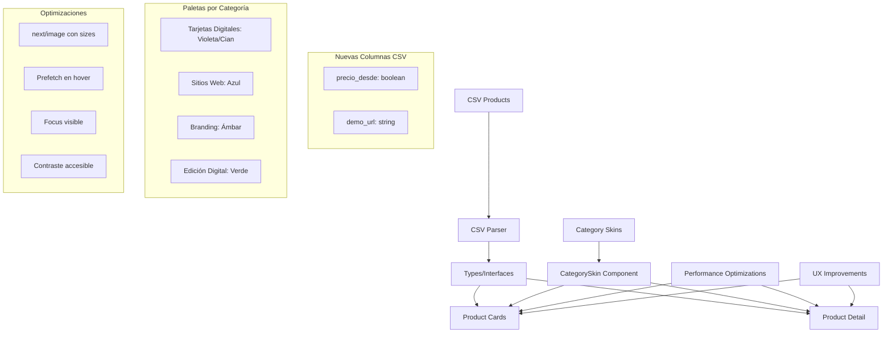

# Plan de Mejoras del Sistema de Productos EXOstudioV

## Resumen del Proyecto
Implementación de nuevas funcionalidades y mejoras en el sistema de productos incluyendo:
- Nuevas columnas en CSV (precio_desde, demo_url)
- Sistema de skins por categoría
- Optimizaciones de performance
- Mejoras de UX y accesibilidad

## Diagrama de Arquitectura del Sistema Actualizado

## Plan de Implementación Detallado

### Fase 1: Actualización de Datos (CSV + Types)
1. **Actualizar archivo CSV con nuevas columnas y ejemplos**
   - Agregar: `precio_desde;demo_url` al final de la cabecera
   - Actualizar ejemplos existentes con valores booleanos y URLs
   - Añadir 2 nuevos productos: "Creación de Páginas Web" y "Restauración de Fotos"

2. **Actualizar tipos TypeScript**
   - Extender interfaz `Product` con `precio_desde?: boolean` y `demo_url?: string | null`
   - Actualizar interfaces derivadas `ProductCard` y `ProductDetail`

3. **Modificar parser CSV**
   - Implementar funciones `toBool()` y `sanitizeUrl()`
   - Agregar parsing de nuevas columnas con defaults para compatibilidad

### Fase 2: Sistema de Skins por Categoría
4. **Implementar paletas en theme.ts**
   - Crear `CATEGORY_SKINS` con colores específicos por categoría
   - Mantener `DEFAULT_SKIN` para productos sin categoría específica

5. **Crear componente CategorySkin**
   - Wrapper que aplica variables CSS scopiadas
   - Solo afecta la sección del producto, preservando header/footer globales

6. **Actualizar ProductCard**
   - Usar variables CSS arbitrarias de Tailwind
   - Implementar hover effects con colores de categoría
   - Mantener accesibilidad y contraste

### Fase 3: Páginas de Detalle
7. **Implementar nuevas funcionalidades**
   - Mostrar "Desde S/ X" cuando `precio_desde = true`
   - Botón "Ver demo" cuando `demo_url` existe
   - Aplicar CategorySkin wrapper

8. **Banner "Proyecto personalizado"**
   - Colocar antes del grid de productos
   - Usar skin global (no por categoría)
   - CTA específico con parámetros UTM

### Fase 4: Performance y UX
9. **Optimizar imágenes next/image**
   - Configurar sizes correctos para hero y cards
   - Usar `priority` solo en hero principal

10. **Prefetch en hover**
    - Componente `CardLink` con `router.prefetch()`
    - Activar solo en hover para optimizar carga

### Fase 5: Accesibilidad y Validación
11. **Validar contraste y focus**
    - Verificar ratios 4.5:1 en todas las paletas
    - Implementar focus visible en todos los CTAs
    - Respetar `prefers-reduced-motion`

12. **Testing integral**
    - Verificar funcionamiento con CSV legacy
    - Probar todas las categorías y skins
    - Validar performance con Lighthouse

## Entregables Esperados
- ✅ CSV actualizado con nuevos productos y columnas
- ✅ Sistema de tipos actualizado y compatible
- ✅ Skins por categoría funcionando
- ✅ Performance optimizada
- ✅ Accesibilidad mejorada
- ✅ Banner de proyectos personalizados
- ✅ Documentación actualizada

## Consideraciones Técnicas
- **Backwards Compatibility**: El parser debe manejar CSVs antiguos sin romper
- **Performance**: Mantener < 3s de carga inicial
- **Accesibilidad**: Cumplir WCAG 2.1 AA
- **Mobile First**: Responsive design priorizado
- **SEO**: Preservar metadatos y structured data existentes